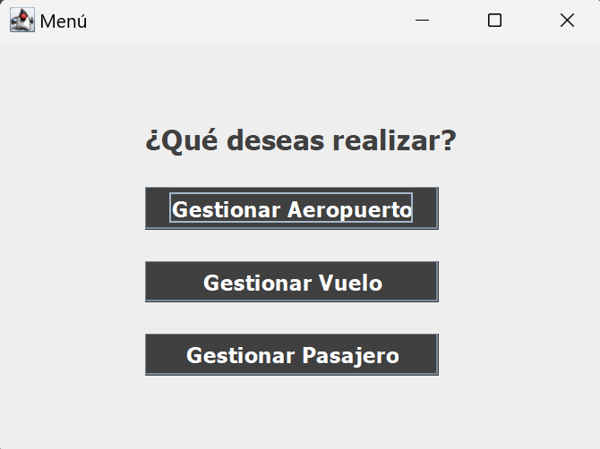
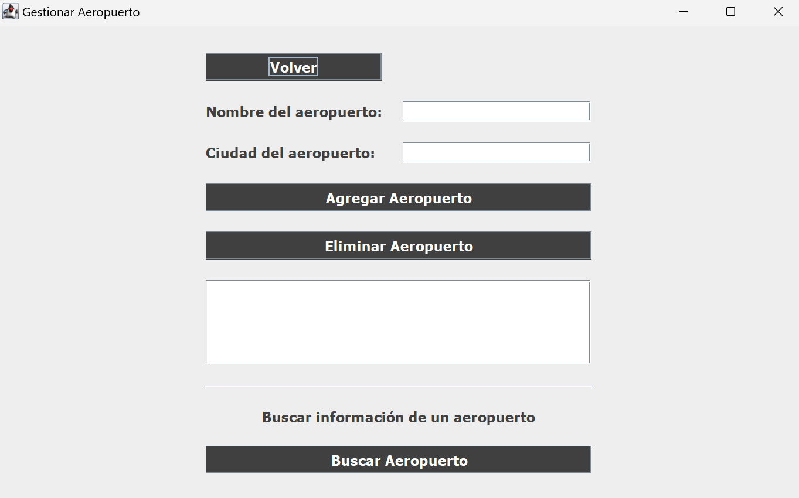
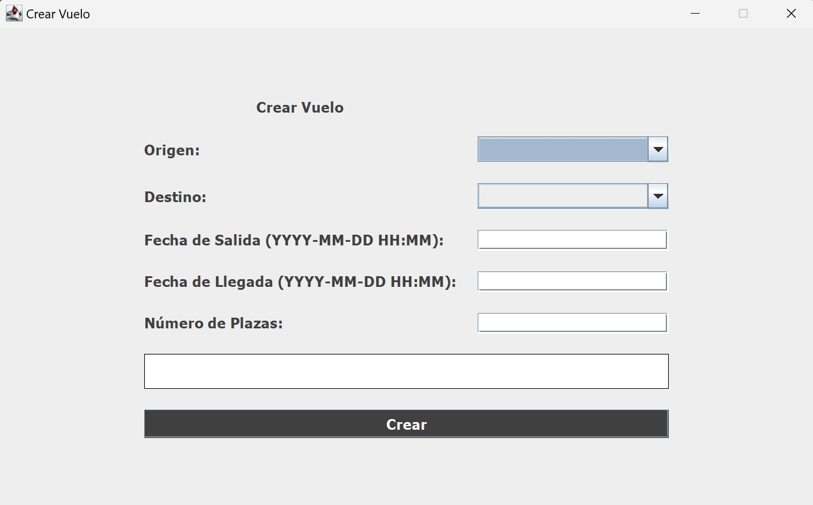

# Aeropuerto MVC

Este proyecto es una aplicación que realicé cursando primero de DAW. Se trata de un software que permite gestionar aeropuertos y está desarrollada en vanilla Java utilizando el modelo MVC (Modelo-Vista-Controlador). La aplicación permite gestionar vuelos, pasajeros y aeropuertos, interactuando con una base de datos para el almacenamiento de datos. La interfaz gráfica está construida con Java Swing.

## Características

- Gestión de vuelos
- Registro y consulta de pasajeros
- Administración de aeropuertos
- Interacción con base de datos para almacenamiento de información
- Interfaz gráfica amigable usando Java Swing

## Tecnologías Utilizadas

- **Java**: Lenguaje de programación
- **Swing**: Biblioteca para la creación de interfaces gráficas
- **JDBC**: Conexión a la base de datos
- **Base de datos**: MySQL

## Requisitos

- JDK 18 o superior
- Dependencias de la base de datos (MySQL)

## Capturas de pantalla de la aplicación

